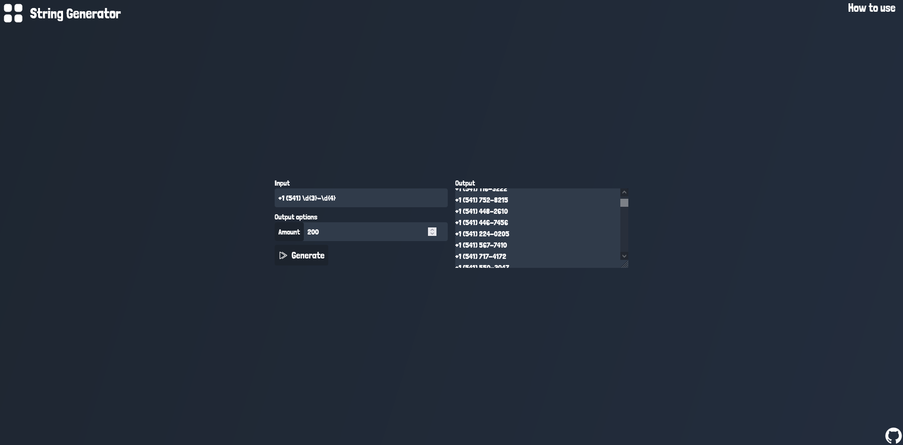

# String Generator

## Getting started

Build with ``npm run build``,
run with ``npm run start``.

## Constribute

You want to constribute this project? That's cool!
Fork this project and create a pull request.

It would be nice, if you choose some items of TODO.

## TODO

- Responsive design
- Community section
- Button to download output
